<div align="center">

<picture>
  <source media="(prefers-color-scheme: dark)" srcset="docs/images/logo-dark.svg">
  
</picture>

### Beautiful GitHub profile cards, rendered by your own GitHub Action.

A 3D contribution landscape, stats, languages, repo cards and more, in 14 themes that follow each visitor's dark or light mode.<br>
Self-hosted: no servers, no shared rate limits, nothing to deploy.

<p>
  <a href="https://github.com/chethandvg/profilescape/actions/workflows/ci.yml"></a>
  <a href="https://github.com/chethandvg/profilescape/releases"></a>
  <a href="https://github.com/marketplace/actions/profilescape-github-profile-cards"></a>
  <a href="LICENSE"></a>
</p>

<a href="#quick-start-in-60-seconds"><b>Quick start</b></a> ·
<a href="#gallery"><b>Gallery</b></a> ·
<a href="#configuration"><b>Configuration</b></a> ·
<a href="https://chethandvg.github.io/profilescape"><b>Playground</b></a> ·
<a href="docs/faq.md"><b>FAQ</b></a>

</div>

<br>

<p align="center">
  <picture>
    <source media="(prefers-color-scheme: dark)" srcset="docs/images/3d-dark.svg">
    
  </picture>
</p>

<p align="center"><sub>Every card on this page is real Profilescape output, rendered from a fictional demo profile.</sub></p>

## Why Profilescape

- **No rate limits, no servers.** It runs inside your own workflow with your own token and commits plain SVG files to a branch of your repository. There is no shared token pool to run dry and no third-party service to go down.
- **Private work counts, if you want it to.** Add a read-only personal access token ([settings](#private-contributions)) and private contributions and repositories are included. Leave it out and the cards use public data only.
- **Follows GitHub's dark and light mode.** Every card is rendered in both modes and wrapped in `<picture>`, so it always matches the visitor's theme.
- **8 cards, 14 themes, any colour.** Mix the cards you like, pick a theme, and override any colour token with a few lines of JSON.
- **Zero runtime dependencies, deterministic output.** One bundled file, built in CI from the sources in this repository, easy to audit and to pin to a commit SHA. The same data always produces the same bytes, so the output branch only gets a commit when something actually changed.
- **Accessible and calm.** Every card has an accessible title and alt text. Animations are pure CSS, respect `prefers-reduced-motion`, and the static frame is always the complete card.

## Quick start in 60 seconds

> [!TIP]
> **Zero config:** [create your profile from the template](https://github.com/chethandvg/profilescape-template/generate) (**Use this template** on [chethandvg/profilescape-template](https://github.com/chethandvg/profilescape-template)), name the repository exactly like your username, then run the workflow once from the **Actions** tab.

Already have a profile README? Two steps:

1. Add these markers to the `README.md` of your profile repository (the one named after your username, for example `octocat/octocat`), where the cards should appear:

   ```md
   <!-- profilescape:start -->
   <!-- profilescape:end -->
   ```

2. Create `.github/workflows/profilescape.yml`:

   ```yaml
   name: Profilescape

   on:
     schedule:
       - cron: "0 3 * * *" # every day at 03:00 UTC
     workflow_dispatch:

   permissions:
     contents: write

   jobs:
     cards:
       runs-on: ubuntu-latest
       steps:
         - uses: chethandvg/profilescape@v1
           with:
             cards: hero,stats,3d,languages,repos
             theme: aurora
             readme: README.md
             # Optional: include private contributions (see "Private contributions" below).
             # token: ${{ secrets.PROFILESCAPE_TOKEN }}
   ```

Open **Actions → Profilescape → Run workflow**. About a minute later your cards appear between the markers, and they refresh every day.

The SVGs live on the `profilescape-output` branch (one commit, rewritten only when something changed), and the README gets ready-made `<picture>` markup that switches with each viewer's theme. The markup's alt text carries your latest numbers for screen readers, so on an active account the README gets a small `[skip ci]` commit most days. Without `readme`, copy the markup from the job summary instead, and your default branch gets no commits at all.

## Gallery

Every card in dark and light. Switch your GitHub theme to see the other variant. The options shown are the ones used for each image; [docs/cards.md](docs/cards.md) documents every option.

### 3D contribution landscape · `3d`

Your last year as an isometric landscape: every column is a day, its height and colour grow with the work you shipped, your best day gets a callout, and insights summarise your busiest month, favourite weekday and active days.

<p align="center">
  <picture>
    <source media="(prefers-color-scheme: dark)" srcset="docs/images/3d-sunset-dark.svg">
    
  </picture>
</p>

Key options: `scale` (`sqrt`, `linear` or `log`), `weeks` (26 to 53), `height`, `insights`, `peak`, `hideTitle`. Shown above with `theme: sunset`.

### Stats · `stats`

A gradient headline number, metric tiles you pick and order, and a weekly contribution chart. `chart: none` makes a compact, numbers-only card.

<p align="center">
  <picture>
    <source media="(prefers-color-scheme: dark)" srcset="docs/images/stats-dark.svg">
    
  </picture>
  <picture>
    <source media="(prefers-color-scheme: dark)" srcset="docs/images/stats-compact-dark.svg">
    
  </picture>
</p>

Key options: `metrics` (3 to 9 of `currentStreak`, `longestStreak`, `commits`, `pullRequests`, `issues`, `reviews`, `allTime`, `bestWeek`, `bestDay`, `activeDays`, `years`, `stars`, `followers`, `repos`), `chart` (`weekly` or `none`), `title`, `hideTitle`.

### Languages · `languages`

Your languages in their GitHub colours, weighted by the commits you actually made in each repository over the last year (or by code size), as a bar, a donut or a compact half-width card.

<p align="center">
  <picture>
    <source media="(prefers-color-scheme: dark)" srcset="docs/images/languages-dark.svg">
    
  </picture>
  <picture>
    <source media="(prefers-color-scheme: dark)" srcset="docs/images/languages-donut-dark.svg">
    
  </picture>
</p>

Key options: `layout` (`bar`, `donut` or `compact`), `weighting` (`commits` or `bytes`), `top`, `hide`, `title`. Shown with the default layout and with `layout: donut`.

### Repo cards · `repos`

One card per repository: your pinned repositories (or the ones you list in the `repos` input), falling back to your most starred. Compact half-width tiles for a profile, or a detailed full-width card for a project README.

<p align="center">
  <picture>
    <source media="(prefers-color-scheme: dark)" srcset="docs/images/repos-dark.svg">
    
  </picture>
  <picture>
    <source media="(prefers-color-scheme: dark)" srcset="docs/images/repos-detail-dark.svg">
    
  </picture>
</p>

Key options: `layout` (`compact` or `detail`), `count` (1 to 12), `showOwner`, `descriptionLines`, `title`. Shown with the defaults and with `layout: detail`.

### Hero banner · `hero`

An animated banner built from your profile: status line, gradient name, role, tagline, tech chips and an editor that types out a snippet about you in your top language.

<p align="center">
  <picture>
    <source media="(prefers-color-scheme: dark)" srcset="docs/images/hero-dark.svg">
    
  </picture>
</p>

Key options: `name`, `role`, `tagline`, `chips`, `status` (`none` hides it), `statusColor`, `code` (`auto`, `none` or your own snippet), `codeLanguage`, `codeFile`. Everything defaults to your GitHub profile.

### Contribution grid · `grid`

The familiar heatmap, coloured by your theme and animated: a light wave pulses across your year (`pulse`), or columns rain into place and your busiest days twinkle (`rain`).

<p align="center">
  <picture>
    <source media="(prefers-color-scheme: dark)" srcset="docs/images/grid-dark.svg">
    
  </picture>
</p>

Key options: `style` (`pulse` or `rain`), `weeks` (26 to 53), `cellSize`, `loop`, `hideStats`, `title`.

### Tech stack · `stack`

Brand logos for the technologies you use, as tiles or chips. Logos come from Simple Icons; anything without a logo gets a tasteful monogram.

<p align="center">
  <picture>
    <source media="(prefers-color-scheme: dark)" srcset="docs/images/stack-dark.svg">
    
  </picture>
  <picture>
    <source media="(prefers-color-scheme: dark)" srcset="docs/images/stack-chips-dark.svg">
    
  </picture>
</p>

Key options: `icons` (slugs or aliases such as `typescript`, `csharp`, `k8s`; append `:Label` to rename), `style` (`tiles` or `chips`), `perRow`, `title`, `hideTitle`. Defaults to your top languages. Shown with `"icons": ["typescript", "react", "nodedotjs", "rust", "go", "docker", "kubernetes", "postgresql"]`.

### Social badges · `socials`

One small badge per link, each linking to its destination. GitHub, X and your website are picked up from your profile automatically.

<p align="center">
  <picture>
    <source media="(prefers-color-scheme: dark)" srcset="docs/images/socials-dark.svg">
    
  </picture>
  <br><br>
  <picture>
    <source media="(prefers-color-scheme: dark)" srcset="docs/images/socials-icons-dark.svg">
    
  </picture>
</p>

Key options: `links`, `style` (`pill` or `icon`), `handles`, `auto`. Shown with `"links": { "linkedin": "mira-chen", "mastodon": "@mira@hachyderm.io", "email": "hello@mira.dev" }`.

### Themes

14 themes, each with a dark and a light palette. Set `theme: <id>`, or try them all in the [playground](https://chethandvg.github.io/profilescape). See [docs/themes.md](docs/themes.md) for every theme on its own and how to propose a new one.

<p align="center">
  <picture>
    <source media="(prefers-color-scheme: dark)" srcset="docs/images/themes-dark.svg">
    
  </picture>
</p>

## Configuration

Most people only need `cards`, `theme` and `readme`. Everything else has a sensible default.

### Inputs

<!-- generated:inputs -->
| Input | Default | Description |
| --- | --- | --- |
| `username` | _empty_ | GitHub username to render cards for. Empty uses the owner of the repository running the workflow. |
| `token` | `${{ github.token }}` | Token used to read profile data from the GitHub API. The default workflow token sees public activity; pass a personal access token (for example `${{ secrets.PROFILESCAPE_TOKEN }}`) to include private repositories and contributions. |
| `cards` | `stats,3d,languages,repos` | Comma-separated cards to render, in README order. Available: `stats`, `languages`, `3d`, `grid`, `repos`, `hero`, `stack`, `socials`. |
| `theme` | `aurora` | Colour theme id, for example `aurora`. Preview every theme in the playground at https://chethandvg.github.io/profilescape. |
| `modes` | `dark,light` | Colour modes to render: `dark`, `light` or both. With both, the README markup follows each viewer's GitHub theme automatically. |
| `animate` | `true` | Add subtle CSS animations. Viewers who prefer reduced motion always get the static final frame. |
| `history` | `full` | Contribution history to fetch: `full` (every year since the account was created) or `year` (the last 12 months, faster). |
| `hide_languages` | _empty_ | Comma-separated languages to leave out of language statistics, for example `HTML,Jupyter Notebook`. |
| `exclude_repos` | _empty_ | Comma-separated repositories (`name` or `owner/name`) to ignore in every card. |
| `include_private` | `true` | Include private repositories the token can read in repository and language statistics. Contribution counts always follow what the token can see, so use the default workflow token for public-only counts. |
| `repos` | _empty_ | Comma-separated repositories for repo cards (`name` or `owner/name`). Empty uses your pinned repositories, then your most starred. |
| `config` | _empty_ | Optional JSON config with per-card options and colour overrides: a path relative to the repository root (requires `actions/checkout`) or inline JSON. |
| `output_dir` | `profilescape` | Workspace directory the SVG files and a ready-to-paste `README-snippet.md` are written to, for use by later steps. |
| `publish` | `branch` | Where to publish the SVG files: `branch` commits them to the output branch (only when something changed), `none` only writes them to `output_dir`. |
| `branch` | `profilescape-output` | Dedicated branch that holds the published SVG files. It is replaced wholesale on every publish (a single commit, so it never bloats your history); Profilescape refuses to overwrite your default branch or any branch it did not create. |
| `commit_message` | `chore: update profilescape cards` | Commit message for the output branch and README updates. |
| `readme` | _empty_ | README to keep up to date, for example `README.md`. The cards are written between `<!-- profilescape:start -->` and `<!-- profilescape:end -->` markers. Empty leaves READMEs untouched. |
| `github_token` | `${{ github.token }}` | Token used to push the output branch and README update to this repository. Needs `contents: write`. |
<!-- /generated:inputs -->

Outputs: `files`, `markup` and `base_url`; see [docs/configuration.md](docs/configuration.md#outputs).

### Config file

Per-card options and colour overrides live in a JSON config, passed with the `config` input as a path (run `actions/checkout` first) or inline. Comments and trailing commas are allowed.

```yaml
      - uses: actions/checkout@v7
      - uses: chethandvg/profilescape@v1
        with:
          config: .github/profilescape.json
          readme: README.md
```

```jsonc
// .github/profilescape.json
{
  "theme": "tokyonight",
  "cards": ["hero", "stats", "3d", "languages", "repos", "socials"],
  "hideLanguages": ["HTML", "Jupyter Notebook"],
  "colors": { "accentA": "#FF7A59" },
  "options": {
    "hero": { "role": "Platform engineer", "status": "open to new roles", "codeLanguage": "go" },
    "stats": { "metrics": ["currentStreak", "longestStreak", "pullRequests", "reviews", "stars", "allTime"] },
    "languages": { "layout": "donut", "top": 8 },
    "3d": { "scale": "linear", "weeks": 40 },
    "repos": { "count": 6, "descriptionLines": 2 },
    "socials": { "links": { "linkedin": "your-handle", "email": "you@example.com" }, "handles": true }
  }
}
```

Precedence is **built-in defaults < config JSON < inputs**. An input left at its `action.yml` default counts as "not set", so `theme: aurora` in the workflow does not override `"theme": "tokyonight"` in the config. The full rules, every config key and every colour token are in [docs/configuration.md](docs/configuration.md).

### Colours

Start from a theme and override any token: `colors` applies to both modes, `darkColors` and `lightColors` on top of it for one mode.

```json
{
  "theme": "github",
  "colors": { "accentA": "#8B5CF6", "accentB": "#22D3EE" },
  "darkColors": { "panel": "#0D1117", "border": "#30363D" },
  "lightColors": { "panel": "#FFFFFF" }
}
```

Tokens: `bg`, `panel`, `panelAlt`, `border`, `text`, `muted`, `faint`, `accentA`, `accentB`, `success`, `chipBg`, `empty`, `grid`, `gridOpacity`, `glowOpacity` and `syntax` (`keyword`, `type`, `string`, `property`, `number`, `punctuation`, `comment`). Contribution colours are derived from `empty`, `accentA` and `accentB`.

### Private contributions

The default workflow token only sees public activity. Create a [fine-grained personal access token](https://github.com/settings/personal-access-tokens/new) for your account with **All repositories** and the read-only **Contents** and **Metadata** repository permissions, save it as a repository secret named `PROFILESCAPE_TOKEN`, and pass it as `token: ${{ secrets.PROFILESCAPE_TOKEN }}`. Keep `github_token` on its default so the personal token is never used to write. Details in [docs/configuration.md](docs/configuration.md#private-contributions).

## Standalone actions

Prefer a Marketplace listing for exactly what you need? These single-purpose actions run the identical engine with a different `cards` default and accept every input above.

> [!IMPORTANT]
> Render all your cards in **one step**: one action with a `cards` list, as in the quick start. Every step replaces its whole output branch, and a README has one marker block, so two steps that share a `branch` delete each other's images, and two that both set `readme` overwrite each other's markup. If you really need separate steps, give each its own `branch` and set `readme` on one of them only; place the other step's images yourself with the markup from its job summary.

<!-- generated:actions -->
| Action | Renders | Step |
| --- | --- | --- |
| [Profilescape - GitHub Profile Cards](https://github.com/chethandvg/profilescape) | any card (default: `stats`, `3d`, `languages`, `repos`) | `uses: chethandvg/profilescape@v1` |
| [Profilescape 3D Contribution Graph](https://github.com/chethandvg/profilescape-3d) | `3d` | `uses: chethandvg/profilescape-3d@v1` |
| [Profilescape Stats Card](https://github.com/chethandvg/profilescape-stats) | `stats` | `uses: chethandvg/profilescape-stats@v1` |
| [Profilescape Top Languages Card](https://github.com/chethandvg/profilescape-languages) | `languages` | `uses: chethandvg/profilescape-languages@v1` |
| [Profilescape Repo Cards](https://github.com/chethandvg/profilescape-repo-cards) | `repos` | `uses: chethandvg/profilescape-repo-cards@v1` |
| [Profilescape Hero Banner](https://github.com/chethandvg/profilescape-hero) | `hero`, `stack`, `socials` | `uses: chethandvg/profilescape-hero@v1` |
| [Profilescape Contribution Grid](https://github.com/chethandvg/profilescape-grid) | `grid` | `uses: chethandvg/profilescape-grid@v1` |
<!-- /generated:actions -->

## CLI and playground

Render cards locally, no install and no token needed for the demo profile:

```sh
npx github:chethandvg/profilescape --demo --cards all --theme dracula
```

Use your own data with a token, for example from the GitHub CLI:

```sh
GH_TOKEN=$(gh auth token) npx github:chethandvg/profilescape --user octocat --cards all --out profilescape
```

The CLI writes the SVGs and a `README-snippet.md` to `--out`. Run it with `--help` for every flag, `--list-themes` and `--list-cards` for the catalogue.

Rather click than configure? The [playground](https://chethandvg.github.io/profilescape) renders every card and theme live in your browser and gives you the workflow to copy.

## How it compares

Hosted stat-card services are a great way to get started: paste a URL and you are done. Profilescape makes a different trade-off, a one-time workflow in exchange for independence.

| | Profilescape | Typical hosted card service |
| --- | --- | --- |
| Where rendering happens | Your Actions runner | A shared server |
| API quota | Your own token, a few requests a day | Often a shared token pool, which can hit rate limits at busy times |
| Private contributions | Optional, with your own read-only token | Usually means deploying your own instance |
| Image availability | Static files in your repository | Depends on the service being up |
| Your data | Never leaves GitHub | Passes through the service |
| Freshness | On your schedule (daily by default in the examples) | On request, behind caches |
| Dark and light | Both rendered, switched automatically | Often one theme per URL |
| Setup | One workflow file, or the template | Paste a URL |

## FAQ

Images not updating, private profile repositories, forks, reduced motion, fonts and more: see the [FAQ](docs/faq.md).

## Security

Profilescape uses `token` only to read from the GitHub API and `github_token` only to write the output branch and, if set, your README in the repository running the workflow. The job needs nothing beyond `contents: write`. For extra supply-chain safety, pin the action to a full commit SHA:

```yaml
      - uses: chethandvg/profilescape@<full-commit-sha> # v1.x.y
```

Please report vulnerabilities privately; see [SECURITY.md](SECURITY.md).

## Contributing

Bug fixes, themes, cards and docs are all welcome. [CONTRIBUTING.md](CONTRIBUTING.md) gets you from clone to pull request, and [docs/ARCHITECTURE.md](docs/ARCHITECTURE.md) explains how the pieces fit together. Questions and ideas go to [Discussions](https://github.com/chethandvg/profilescape/discussions). Profilescape is actively maintained.

## License

[MIT](LICENSE). Brand logos in the stack and socials cards come from [Simple Icons](https://simpleicons.org) (CC0) and are trademarks of their respective owners.

<br>

<p align="center"><sub>Made by <a href="https://github.com/chethandvg">Chethan D V</a></sub></p>
