# Cards

Profilescape has eight cards. Pick them with the `cards` input (in README order) and tune each one with per-card options in the [config JSON](configuration.md#config-json).

```yaml
      - uses: chethandvg/profilescape@v1
        with:
          cards: hero,stats,3d,languages,repos,stack,socials
          config: .github/profilescape.json
          readme: README.md
```

Options go under `options`, keyed by card id:

```json
{
  "options": {
    "stats": { "chart": "none" },
    "repos": { "layout": "detail", "count": 2 }
  }
}
```

| Card | Id | Images it writes |
| --- | --- | --- |
| [3D contribution landscape](#3d-contribution-landscape--3d) | `3d` | `3d-dark.svg`, `3d-light.svg` |
| [Stats](#stats--stats) | `stats` | `stats-*.svg` |
| [Languages](#languages--languages) | `languages` | `languages-*.svg` |
| [Repo cards](#repo-cards--repos) | `repos` | one `repo-<owner>-<name>-*.svg` per repository |
| [Hero banner](#hero-banner--hero) | `hero` | `hero-*.svg` |
| [Contribution grid](#contribution-grid--grid) | `grid` | `grid-*.svg` |
| [Tech stack](#tech-stack--stack) | `stack` | `stack-*.svg` |
| [Social badges](#social-badges--socials) | `socials` | one `social-<platform>-*.svg` per link |

`cards` also accepts `all` and a few friendly aliases, such as `landscape` for `3d`, `banner` for `hero` and `heatmap` for `grid`.

**How options are read.** Option names are case-sensitive. Lists accept a JSON array or a comma-separated string, booleans accept `true`/`false` (or `"yes"`, `"on"`, `"1"`), and numbers outside the documented range are clamped. A value a card does not recognise falls back to the default rather than failing the run, so check the preview after changing options: the [playground](https://chethandvg.github.io/profilescape) shows the result instantly, and so does the CLI (`npx github:chethandvg/profilescape --demo --config my-config.json`).

The option tables below are generated from the cards' source code by `npm run gallery`, so they always match the code.

---

## 3D contribution landscape · `3d`

Your last year of contributions as an isometric landscape: every day is a column whose height and colour grow with the work done, your best day is pinned with a callout, and insights summarise your busiest month, favourite weekday and active days. It is the flagship card.

<picture>
  <source media="(prefers-color-scheme: dark)" srcset="images/3d-dark.svg">
  
</picture>

<!-- generated:options:3d -->
| Option | Type | Default | Description |
| --- | --- | --- | --- |
| `title` | string | `"Contribution landscape"` | Header label, shown in small caps above the total. |
| `hideTitle` | boolean | `false` | Hide the header (label and total) for a cleaner embed. |
| `insights` | boolean | `true` | Show best day, busiest month, favourite weekday and active days. |
| `peak` | boolean | `true` | Pin a small callout on the tallest bar (your best day). |
| `scale` | string | `"sqrt"` | Bar height scale: "sqrt" (keeps quiet days visible next to outliers), "linear" or "log". |
| `weeks` | number | `53` | Number of weeks to show, 26 to 53. Fewer weeks means bigger bars. |
| `height` | number | `124` | Height of the tallest bar in px, 40 to 240. |
<!-- /generated:options:3d -->

The default `sqrt` scale keeps quiet days visible next to big outliers; `linear` is the honest ratio and `log` flattens everything. Fewer `weeks` means bigger columns.

```json
{ "options": { "3d": { "weeks": 40, "height": 160, "scale": "linear", "insights": false } } }
```

## Stats · `stats`

Your last 12 months at a glance: a gradient headline number, a grid of metric tiles you pick and order, and a weekly contribution chart.

<picture>
  <source media="(prefers-color-scheme: dark)" srcset="images/stats-dark.svg">
  
</picture>

With `"chart": "none"` it becomes a compact, numbers-only card:

<picture>
  <source media="(prefers-color-scheme: dark)" srcset="images/stats-compact-dark.svg">
  
</picture>

<!-- generated:options:stats -->
| Option | Type | Default | Description |
| --- | --- | --- | --- |
| `metrics` | list | `["currentStreak", "longestStreak", "commits", "allTime", "bestWeek", "years"]` | Tiles to show, in order (3 to 9, laid out in rows of 3). Any of: currentStreak, longestStreak, commits, pullRequests, issues, reviews, allTime, bestWeek, bestDay, activeDays, years, stars, followers, repos. |
| `chart` | string | `"weekly"` | "weekly" shows 52 weekly bars; "none" makes a compact, numbers-only card. |
| `title` | string | `"Activity · last 12 months"` | Header label text. |
| `hideTitle` | boolean | `false` | Hide the header label and tighten the layout. |
<!-- /generated:options:stats -->

Tiles are laid out in rows of three, so 3, 6 or 9 metrics fill the grid neatly.

```json
{
  "options": {
    "stats": {
      "metrics": ["currentStreak", "longestStreak", "pullRequests", "reviews", "stars", "followers"],
      "title": "This year on GitHub"
    }
  }
}
```

## Languages · `languages`

Your most used languages in their official GitHub colours. By default each repository's languages are weighted by the commits you made there in the last 12 months, so one vendored library or generated file cannot dominate; `"weighting": "bytes"` uses raw code size instead.

<picture>
  <source media="(prefers-color-scheme: dark)" srcset="images/languages-dark.svg">
  
</picture>

<picture>
  <source media="(prefers-color-scheme: dark)" srcset="images/languages-donut-dark.svg">
  
</picture>

<table>
  <tr>
    <td width="50%">
      <picture>
        <source media="(prefers-color-scheme: dark)" srcset="images/languages-compact-dark.svg">
        
      </picture>
    </td>
    <td width="50%">
      <code>"layout": "compact"</code> renders a half-width card. Profilescape pairs half-width images side by side in the README markup, for example with a compact repo card.
    </td>
  </tr>
</table>

<!-- generated:options:languages -->
| Option | Type | Default | Description |
| --- | --- | --- | --- |
| `weighting` | string | `"commits"` | "commits" weights each repo's languages by your commits in the last 12 months; "bytes" uses raw code size. |
| `layout` | string | `"bar"` | "bar" (stacked bar + legend), "donut" (donut + legend with bars) or "compact" (half-width card). |
| `top` | number | `6` | Languages to show (1 to 10); the rest fold into "Other". |
| `hide` | list | `[]` | Language names to leave out (case-insensitive), e.g. ["Jupyter Notebook", "HTML"]. |
| `title` | string | _see description_ | Header label text. Defaults to a label that states the weighting. |
| `hideTitle` | boolean | `false` | Hide the header row and tighten the layout. |
<!-- /generated:options:languages -->

The `hide_languages` input (or `hideLanguages` in the config) removes languages from the aggregated language data at fetch time, which also feeds the hero chips and the default tech stack; the card's own `hide` option only affects this card.

```json
{ "options": { "languages": { "layout": "donut", "top": 8, "hide": ["Jupyter Notebook"] } } }
```

## Repo cards · `repos`

One card per repository, each linking to it. Without configuration you get your pinned repositories as they are (including pinned forks, archived repositories and other people's repositories), then your most starred repositories, which skips forks and archived repositories. Private repositories and your profile-README repository are never picked automatically. List repositories explicitly with the `repos` input (`name` for your own, `owner/name` for anyone's) to choose exactly what is shown.

<picture>
  <source media="(prefers-color-scheme: dark)" srcset="images/repos-dark.svg">
  
</picture>

`"layout": "detail"` renders a full-width card with every number, the language breakdown and topics, made for a project's own README:

<picture>
  <source media="(prefers-color-scheme: dark)" srcset="images/repos-detail-dark.svg">
  
</picture>

<!-- generated:options:repos -->
| Option | Type | Default | Description |
| --- | --- | --- | --- |
| `layout` | string | `"compact"` | "compact" (400px half-width tiles) or "detail" (1200px card for a project README). |
| `count` | number | `4` | How many repositories to render (1-12). |
| `showOwner` | boolean | _see description_ | Prefix the name with "owner/". Defaults to true for detail; compact shows it only for repos you do not own. |
| `descriptionLines` | number | _see description_ | Maximum description lines (1-4). Defaults to 3 for compact, 2 for detail. |
| `title` | string | _see description_ | Replaces the category label (default: primary language and topics, e.g. "TYPESCRIPT · REACT"). |
<!-- /generated:options:repos -->

```yaml
      - uses: chethandvg/profilescape@v1
        with:
          cards: repos
          repos: my-project,some-org/their-project
          config: '{ "options": { "repos": { "layout": "detail", "count": 2 } } }'
```

## Hero banner · `hero`

An animated banner that opens your profile: a status line with a pulsing dot, your name in a gradient, a role, a tagline, technology chips and a code editor that types out a snippet about you in your top language. Every field defaults to something sensible from your GitHub profile.

<picture>
  <source media="(prefers-color-scheme: dark)" srcset="images/hero-dark.svg">
  
</picture>

<!-- generated:options:hero -->
| Option | Type | Default | Description |
| --- | --- | --- | --- |
| `name` | string | _profile name or login_ | Big gradient headline. |
| `role` | string | _first sentence of your bio, or "Developer"_ | Line under the name. |
| `tagline` | list | _rest of your bio, company and location_ | One string (wrapped to two lines) or a list of up to two lines. |
| `chips` | list | _top languages_ | Small pills under the tagline; known technologies get their logo. |
| `status` | string | _"open to collaboration · &lt;location&gt;"_ | Status line with a pulsing dot; "none" hides it. |
| `statusColor` | string | _palette success_ | Dot colour: hex (#3FB950) or a palette token (accentA, accentB, success). |
| `code` | string | `"auto"` | "auto" writes a snippet from your profile, "none" hides the editor, any other text is shown as code (max 9 lines). |
| `codeLanguage` | string | _top language_ | Highlighting and snippet language: csharp, typescript, javascript, python, go, rust, java, kotlin, swift, ruby, php, json. |
| `codeFile` | string | _per language (Program.cs, profile.ts, me.py…)_ | File name in the editor title bar. |
<!-- /generated:options:hero -->

```json
{
  "options": {
    "hero": {
      "role": "Staff engineer · developer tools",
      "tagline": ["I build fast, friendly tooling.", "Open source at heart."],
      "chips": ["TypeScript", "Rust", "Kubernetes"],
      "status": "open to collaboration",
      "codeLanguage": "rust"
    }
  }
}
```

Set `"code": "none"` for a banner without the editor, or pass your own snippet (up to 9 lines) as `code`.

## Contribution grid · `grid`

Your contribution calendar, coloured by your theme and animated. `pulse` sends a light wave across your year; `rain` drops the columns into place and then makes your busiest days twinkle. Viewers who prefer reduced motion see the finished grid.

<picture>
  <source media="(prefers-color-scheme: dark)" srcset="images/grid-dark.svg">
  
</picture>

<picture>
  <source media="(prefers-color-scheme: dark)" srcset="images/grid-rain-dark.svg">
  
</picture>

<!-- generated:options:grid -->
| Option | Type | Default | Description |
| --- | --- | --- | --- |
| `style` | string | `"pulse"` | "pulse" (a light wave sweeps across your year) or "rain" (columns drop in, then your busiest days twinkle). |
| `weeks` | number | `53` | Weeks to show, 26 to 53, ending today. |
| `cellSize` | number | _auto_ | Cell size in px (8 to 40). By default cells grow to fill the 1200px card; smaller values make a narrower card. |
| `title` | string | `"Contributions · last 12 months"` | Header label. |
| `hideTitle` | boolean | `false` | Hide the header label. |
| `hideStats` | boolean | `false` | Hide the total / active days / best day line. |
| `loop` | boolean | `true` | Loop the animation forever; false plays it once. |
<!-- /generated:options:grid -->

```json
{ "options": { "grid": { "style": "rain", "loop": false, "hideStats": true } } }
```

## Tech stack · `stack`

Brand icons for the technologies you use, as tiles or chips. Logos come from [Simple Icons](https://simpleicons.org); brands it does not ship (C#, Java, AWS, Azure and others) and anything unknown get a monogram tile, so a requested icon is never missing. Without `icons`, the card shows your top languages that have an icon.

<picture>
  <source media="(prefers-color-scheme: dark)" srcset="images/stack-dark.svg">
  
</picture>

<picture>
  <source media="(prefers-color-scheme: dark)" srcset="images/stack-chips-dark.svg">
  
</picture>

<!-- generated:options:stack -->
| Option | Type | Default | Description |
| --- | --- | --- | --- |
| `icons` | list | _top languages with an icon (max 8)_ | Technologies to show: slugs or aliases (typescript, csharp, k8s, aws…). Append ":Label" to rename one. |
| `style` | string | `"tiles"` | "tiles" (icon above label) or "chips" (pill per technology). |
| `title` | string | `"Tech stack"` | Header label. |
| `hideTitle` | boolean | `false` | Hide the header row. |
| `perRow` | number | `8` | Tiles per row (3–12); rows wrap and the card grows. |
<!-- /generated:options:stack -->

Icon names are Simple Icons slugs (`nodedotjs`, `nextdotjs`, `githubactions`) or common aliases (`node`, `k8s`, `csharp`). Append `:Label` to change the caption.

```json
{ "options": { "stack": { "icons": ["typescript", "react", "nodedotjs:Node", "docker", "k8s", "postgresql"], "style": "chips" } } }
```

## Social badges · `socials`

One small, theme-aware badge per link, each linking to its destination. GitHub, X and your website come from your profile automatically; add more with `links`.

<p>
  <picture>
    <source media="(prefers-color-scheme: dark)" srcset="images/socials-dark.svg">
    
  </picture>
</p>
<p>
  <picture>
    <source media="(prefers-color-scheme: dark)" srcset="images/socials-icons-dark.svg">
    
  </picture>
</p>

<!-- generated:options:socials -->
| Option | Type | Default | Description |
| --- | --- | --- | --- |
| `links` | object | _GitHub, X and website from your profile_ | Links as {"linkedin": "handle", "email": "me@x.dev", "custom": [{"label": "Blog", "url": "https://…"}]} or a list like ["linkedin:handle", "https://…"]. Set a key to false to hide it. |
| `style` | string | `"pill"` | "pill" (icon + label) or "icon" (round icon only). |
| `handles` | boolean | `false` | Show the handle or address after the platform name (pill style). |
| `auto` | boolean | `true` | Add GitHub, X and website links from your profile automatically. |
<!-- /generated:options:socials -->

`links` takes an object of platform handles, plus `custom` links, or a list of `platform:handle` strings and URLs. Set a platform to `false` to hide a link that was added automatically. A URL is matched to its platform by host (a `linkedin.com` URL becomes the LinkedIn badge); any other URL takes the `website` slot and replaces the website from your profile, so add extra pages such as a blog as `custom` links.

```json
{
  "options": {
    "socials": {
      "links": {
        "linkedin": "your-handle",
        "mastodon": "@you@hachyderm.io",
        "email": "you@example.com",
        "x": false,
        "custom": [{ "label": "Blog", "url": "https://example.com/blog" }]
      },
      "handles": true
    }
  }
}
```

The badges are separate images that sit side by side in the README markup, so each one keeps its own link.
