# Themes

Profilescape ships 14 themes. Each has a complete **dark and light** palette, and with the default `modes: dark,light` every card follows the visitor's GitHub theme automatically. The thumbnails below are the compact stats card in each theme: switch your GitHub appearance to see the other mode, or try every card in every theme in the [playground](https://chethandvg.github.io/profilescape).

```yaml
      - uses: chethandvg/profilescape@v1
        with:
          theme: tokyonight
          readme: README.md
```

<picture>
  <source media="(prefers-color-scheme: dark)" srcset="images/themes-dark.svg">
  
</picture>

## All themes

| Theme | Id | Based on |
| --- | --- | --- |
| Aurora | `aurora` | Profilescape's signature theme, violet rising into cyan. The default. |
| GitHub | `github` | GitHub's Primer colours with the familiar contribution-graph greens. |
| Tokyo Night | `tokyonight` | Tokyo Night's Night and Day variants. |
| Dracula | `dracula` | Dracula, with its official light sibling Alucard. |
| Nord | `nord` | Polar Night and Snow Storm surfaces with Frost accents. |
| Catppuccin | `catppuccin` | Catppuccin Mocha and Latte, mauve into peach. |
| Gruvbox | `gruvbox` | Gruvbox dark and light, warm retro tones. |
| Solarized | `solarized` | The classic Solarized base tones and accents. |
| Rosé Pine | `rosepine` | Rosé Pine main and Dawn. |
| One Dark | `onedark` | Atom's One Dark and One Light. |
| Everforest | `everforest` | Everforest's soft greens, blue into green. |
| Kanagawa | `kanagawa` | Kanagawa Wave and Lotus, crystal blue into sakura pink. |
| Monochrome | `monochrome` | Zinc neutrals with a single steel-blue accent, for minimal profiles. |
| Sunset | `sunset` | An original warm theme, coral rising into amber. |

Where an original palette colour misses Profilescape's contrast targets, the nearest accessible shade of that colour is used, so text stays readable in both modes.

## Each theme, dark and light

<table>
  <tr>
    <th width="50%">Dark</th>
    <th width="50%">Light</th>
  </tr>
  <tr><td colspan="2"><b>Aurora</b> · <code>aurora</code> (default)</td></tr>
  <tr>
    <td></td>
    <td></td>
  </tr>
  <tr><td colspan="2"><b>GitHub</b> · <code>github</code></td></tr>
  <tr>
    <td></td>
    <td></td>
  </tr>
  <tr><td colspan="2"><b>Tokyo Night</b> · <code>tokyonight</code></td></tr>
  <tr>
    <td></td>
    <td></td>
  </tr>
  <tr><td colspan="2"><b>Dracula</b> · <code>dracula</code></td></tr>
  <tr>
    <td></td>
    <td></td>
  </tr>
  <tr><td colspan="2"><b>Nord</b> · <code>nord</code></td></tr>
  <tr>
    <td></td>
    <td></td>
  </tr>
  <tr><td colspan="2"><b>Catppuccin</b> · <code>catppuccin</code></td></tr>
  <tr>
    <td></td>
    <td></td>
  </tr>
  <tr><td colspan="2"><b>Gruvbox</b> · <code>gruvbox</code></td></tr>
  <tr>
    <td></td>
    <td></td>
  </tr>
  <tr><td colspan="2"><b>Solarized</b> · <code>solarized</code></td></tr>
  <tr>
    <td></td>
    <td></td>
  </tr>
  <tr><td colspan="2"><b>Rosé Pine</b> · <code>rosepine</code></td></tr>
  <tr>
    <td></td>
    <td></td>
  </tr>
  <tr><td colspan="2"><b>One Dark</b> · <code>onedark</code></td></tr>
  <tr>
    <td></td>
    <td></td>
  </tr>
  <tr><td colspan="2"><b>Everforest</b> · <code>everforest</code></td></tr>
  <tr>
    <td></td>
    <td></td>
  </tr>
  <tr><td colspan="2"><b>Kanagawa</b> · <code>kanagawa</code></td></tr>
  <tr>
    <td></td>
    <td></td>
  </tr>
  <tr><td colspan="2"><b>Monochrome</b> · <code>monochrome</code></td></tr>
  <tr>
    <td></td>
    <td></td>
  </tr>
  <tr><td colspan="2"><b>Sunset</b> · <code>sunset</code></td></tr>
  <tr>
    <td></td>
    <td></td>
  </tr>
</table>

## Make a theme your own

You do not need a new theme to change a colour. Start from the closest theme and override tokens in the [config JSON](configuration.md#colours):

```json
{
  "theme": "nord",
  "colors": { "accentA": "#B48EAD" },
  "darkColors": { "panel": "#2E3440" },
  "lightColors": { "panel": "#ECEFF4" }
}
```

`colors` applies to both modes; `darkColors` and `lightColors` apply on top for one mode. Contribution colours follow `empty`, `accentA` and `accentB`. Every token is listed in [configuration.md](configuration.md#colours).

To render only one mode, set `modes: dark` (or `light`). The README markup then uses a single image for everyone.

## Propose a theme

New themes are very welcome. A theme needs:

- a lowercase `id` and a display name;
- **both** a dark and a light palette with every token in the [`Palette` type](../src/core/types.ts) (the [new theme form](https://github.com/chethandvg/profilescape/issues/new?template=theme_proposal.yml) lists them);
- readable contrast, checked automatically by the [theme tests](../src/core/themes.test.ts): on the card surface (`panel`), `text` at least 7:1, `muted` 4.5:1, `faint` 2.4:1, both accents 3:1 and `success` 2.5:1; on raised tiles (`panelAlt`), `text` at least 6:1 and `muted` 4:1;
- a palette you are allowed to reuse: link the original and check its licence.

Not into code? Open the [theme proposal form](https://github.com/chethandvg/profilescape/issues/new?template=theme_proposal.yml) with your colours and we will help with the rest. Comfortable with TypeScript? Follow [Adding a theme](../CONTRIBUTING.md#adding-a-theme): add a preset to `src/core/theme-presets.ts`, preview it with `node scripts/preview.ts --card all --theme <id>`, run `npm run gallery` to refresh these images, and open a pull request with dark and light screenshots.
